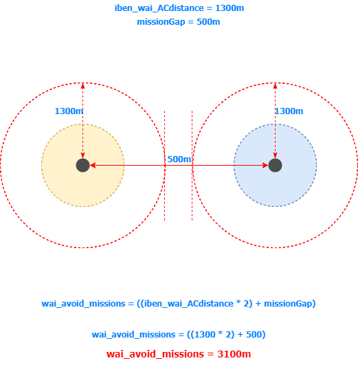

# IWAC - addon for WAI Mission System

**Last update: [2017-11-07], v1.0** ([see changelog](#changelog))

---

[Go to Epoch forum thread][scriptthread]

---

## Credits

**All credit belongs to all authors of used source files:**

+ **DayZ Epoch developers, collaborators and contributors** (thank you guys for your excellent work!) [Visit them on github][epochdevs]
+ **Markk311**, **f3cuk**, **Jossy**, **BangL**, **nerdalertdk**, **Caveman** - creators of this system
+ **JasonTM**, **salival**, **ebayShopper** - for keeping system alive, further developing and fantastic support
+ Special thx goes to:
  + **salival** for his [ZSC remote msg script][remotemsg] which we are using
  + **totis**, who brings great ideas into this script and did a great tester job!
  + **DAmNRelentless** for [offering German translation][germanlng]
  + **... all great guys helping make WAI better (I'm pretty sure I forgot a lot of people...). Thank you all for your great job!**

---
## TOC
<!-- MarkdownTOC -->

- [Introduction](#introduction)
- [Showcase links](#showcase-links)
- [Changelog](#changelog)

<!-- /MarkdownTOC -->

---

<a name="introduction"></a>
## Introduction

_`... once upon a time, *mr. yeahBUT* and *mr. no_name* chatting:`_

> **Q: mr. yeahBUT**
IWAC? OMG, what is it?
**A: mr. no_name**
Well, it's Autoclaim addon for WAI mission system.

---

> **Q: mr. yeahBUT**
...yeah, but is it usefull? What it can do?
**A: mr. no_name**
Not sure about the first question part... but it could be.<br>If one of your server rules says somenthing like: "Player has to claim mission in sidechat and mark mission on map with name", well, this addon is just for you.<br>It's fully automatic, which means - no more sentences like: _"I forgot...", "Who is doing mission xy?", "Could you please remove your marker once mission is finished?"_ etc. This little addon will make all the job for you and your players.

---

> **Q: mr. yeahBUT**
pffff... I have PVP server. Totally useless!
**A: mr. no_name**
Probably yes... Do you wanna hear more?

---

> **Q: mr. yeahBUT**
hmmm.. not really, but I have nothing to do right now, so continue...
**A: mr. no_name**
...OK my friend. I have certainly nothing to do either, so I will... :) What's your question?

---

> **Q: mr. yeahBUT**
ok.. let's start with somenthing I can picture in my mind. Do you have any screenshot so I can see it in action?
**A: mr. no_name**
yeah, sure...


---

> **Q: mr. yeahBUT**
What is that red circle around mission?
**A: mr. no_name**
This is somenthing I call it "claiming zone". You can configure it using these variables:

```c
iben_wai_ACzoneActivate = true; // Turn claiming border ON/OFF
iben_wai_ACzoneMarkerColor = "ColorRed"; // Border color
iben_wai_ACdistance = 1300; // Distance from mission center to claiming border
```

---

> **Q: mr. yeahBUT**
hm.. 1300m? It's a little bit too much. Should be much shorter distance.
**A: mr. no_name**
It's completely up to you. If you want to be loved by your snipers, set it to 400m and set AI skills to max - no kidding, I experienced this setup already :))
Also remember - there is somenthing called timeout distance in WAI - you can search variable `wai_timeout_distance` in WAI config. If `wai_timeout_distance` < `iben_wai_ACdistance`, mission can dissapear in front of player's face (which doesn't mean it's a bad thing...)

---

> **Q: mr. yeahBUT**
Well, it's too bad. Can you imagine what happen if two or three missions spawns close to each other? You think it's not a problem player could claim multiple missions?
**A: mr. no_name**
How should I answer this question...? Let's start with this: When you try to setup any system, you should think about it.
I mean - there are variables `wai_avoid_missions` and `wai_avoid_traders` in WAI config for example. Just use bellow formulas and you should prevent mission (mission claim zones) overlapping:

```c
wai_avoid_missions = ((iben_wai_ACdistance * 2) + 500);
wai_avoid_traders = (iben_wai_ACdistance + 200 + 500);
// ... also see picture bellow:
```



---

> **Q: mr. yeahBUT**
That's nice, but I've already experienced mission placement is not perfect... there is a chance player will claim two missions!
**A: mr. no_name**
In fact, it's not possible. If player is already 'claimer', he is registered and system doesn't allow him to claim multiple times (you can see it in the video at the bottom).

---

> **Q: mr. yeahBUT**
Alright... what's that flag with name? I don't want to expose player name!
**A: mr. no_name**
It's up to you again. You can configure all about player marker using these variables:

```c
iben_wai_ACshowNames = true; // If false, text = "Claimed by a player [realtime status info]"
iben_wai_ACmarkerType = "hd_flag";
iben_wai_ACmarkerColor = "ColorBlack";
```

---

> **Q: mr. yeahBUT**
ok... yeah, but it's too bad to expose player by setting marker on his position
**A: mr. no_name**
You are not exposing his position. Marker is created in random spot within given range. You can adjust it by setting variable:

```c
iben_wai_ACmarkerRange = 400;
```

---

> **Q: mr. yeahBUT**
cool... so why not create flag object to be visible close mission? Cool idea, huh?
**A: mr. no_name**
yeah, sure it is :) You can use these variables:

```c
iben_wai_ACcreateFlagOjb = true;
iben_wai_ACmarkerFlagClass = "FlagCarrierINDFOR_EP1";
// ... see the picture bellow:
```


---

> **Q: mr. yeahBUT**
How will player know about claiming is happening?
**A: mr. no_name**
You can enable message system and let player know. Just use bellow variable and install client side files:

```c
iben_wai_ACplayerMsg = true;
```

---

> **Q: mr. yeahBUT**
Yeah, but... still. Why should all players force to read useless msg that are not about them? Also... that's server resources waste to broadcoast so many msgs...!
**A: mr. no_name**
Actually msg is private. Only player involved is informed and can see the msg.

---

> **Q: mr.yeahBUT**
Yeah... but there is couple more troubles. For example: Mission just spawn close to my position or I'm just passing by location. I don't want to be a part of mission fight, but still... I'm in zone... That's not good.
**A: mr.no_name**
You can use bellow variable and set it to some reasonable value in seconds. That gives passing by players enough time to decide to stay or leave claiming area.

```c
iben_wai_ACsafeClaimDelay = 60;
```

---

> **Q: mr. yeahBUT**
Too many troubles... what about players in bases?
**A: mr. no_name**
Just make your decision if you want to allow players fight missions from base or not. You can use following variables. This way you can force autoclaim system to ignore these players.

```c
iben_wai_ACplotRestriction = true;
iben_wai_ACplotRange = 30; // If 'iben_wai_ACplotRestriction' is true, what distance from plotpole is not allowed?
```

---

> **Q: mr. yeahBUT**
Hm, but what if player claimed the mission and dies, loses connection etc. What then, ha...?
**A: mr. no_name**
As you can see at the above picture, there is marker with player name (or anonymous name) and so called `realtime status`. If player is alive and fighting inside claiming zone, status is `Active`. If player is gone - timeout is fired. That means, system will wait given time for claimer return. If timeout runs off, mission is free for claiming. You can set some reasonable time for timeout in seconds:

```c
iben_wai_ACtimeout = 300;
```

---

> **Q: mr. yeahBUT**
What about my admins? I don't want them to claim missions just because they are helping inside zone...
**A: mr. no_name**
Yeah, got it. You can exclude your admins from system:

```c
iben_wai_ACexcludeAdmins = true;
iben_wai_ACadmins = ["0","0"]; // List your admins UID's
```

---

> **Q: mr. yeahBUT**
Wait! I'm using moving missions like 'patrol'. It's a nonsense to use autoclaim for that kind of missions!
**A: mr. no_name**
Agree. If you have any kind of moving missions, or custom missions you want to be free for all, just exclude them:

```c
iben_wai_ACexcludedTypes = ["patrol"];
```

---

> **Q: mr. yeahBUT**
Ok then. So... I have couple more minutes before my favourite movie starts. So last a few questions: I believe you will face problems in such scenarios like: multiple players in the same time in the zone - who will be first? What about other players? And what about player or better players in vehicle? You will not be able to sort them out and it's gonna be chaos!
**A: mr. no_name**
Well, I made the best I could in given time and space. I don't want to go too deep, but imagin autoclaim system as somenthing like simple `memory buffer`.
This buffer is **(a)** able to recognize all players in area (inlcuding all players inside vehicles); **(b)** is able to sort them out by distance. It's very small probability two players will reach the same distance in the same time - the only exception crossed my mind are players in the same vehicle - they share the same distance. But system is able to recognize them and sort them from driver to cargo. But anyway, system is able to handle these scenarios pretty well (at least I hope so according to test results); **(c)** System works in layers - from register list, wait list to claim list. Each layer is equiped by self-cleaning mechanism, so each list is real image of status in claiming zone. (self-cleaning means, once player leave area etc., he is kicked from list and next player in list takes his place - there are no `dead souls in list`)

---

> **Q: mr. yeahBUT**
OK... here we go. So another loop for WAI. It's already server performace killer as it is...!
**A: mr. no_name**
Hm... good point! And no, we are not creating any extra loop (not single one...). We are using already existing loops - and we are using these loops only and only if it's reasonable and exiting them immediately if condition isn't met. According to couple weeks testing on populated server with cca 20 players, no FPS drop was recognized. BTW: you can add some debug logs to loop critical points and see the result.

---

> **Q: mr. yeahBUT**
...yeah, but I can imagine how installation is gonna be difficult...
**A: mr. no_name**
Actually, it's not. Visit this github repo and clone or download files. **Follow repo structure and merge it with your server/client files.**

---

> **Q: mr. yeahBUT**
That's all you can say about installation??? Are you serious??
**A: mr. no_name**
No and yes. One more thing - addon is designed the way so you don't need to touch any of WAI core files (except a few lines in init). If you will follow repo structure, you can quickly switch between default WAI files and addon files by setting bellow variable to true/false.

```c
iben_wai_ACuseAddon = true;
// :: WARNING > If you don't know what I mean by "merge files" at this momment, you should probably wait a little bit and learn, before you start to play with (especially) server-side files.
```

---

> **Q: mr. yeahBUT**
Hmmm... my movie has just started... have to go now. And BTW... your English sucks... and this addon too... bye
**A: mr. no_name**
_:( ... I know... bye_

---

<a name="showcase-links"></a>
## Showcase links

+ [IWAC - private server msgs, map markers, status, respawn][iwac_01]
+ [IWAC - multiple claiming protection, exclude plotpole area option][iwac_02]

---

<a name="changelog"></a>
## Changelog

| Date         | Version | Description                                                                                           |
| :---         | :---    | :---                                                                                                  |
| [2017-11-07] | v1.0    | Initial release                                                                                       |

---

[scriptthread]: https://epochmod.com/forum/topic/43949-re-release-paint-vehicles-script-using-single-currency-updated-to-1061-and-upgraded/ "Go to source"
[epochdevs]: https://github.com/EpochModTeam/DayZ-Epoch "Go to source"
[remotemsg]: https://github.com/infobeny/ZSC/blob/master/dayz_code/compile/remote_message.sqf "Go to source"
[germanlng]: https://github.com/infobeny/IWAC/pull/1 "Go to source"
[iwac_01]: https://youtu.be/GziJM75XcuM "Go to source"
[iwac_02]: https://youtu.be/lppC_MAse8E "Go to source"
